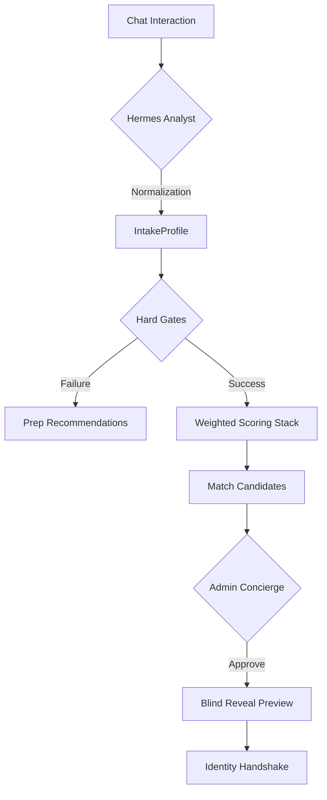

# LaunchHive: Matching Engine Integration & Implementation Guide

This document provides a technical specification for integrating and implementing the LaunchHive V2 matching pipeline. It details the interaction between the Hermes AI analyst, the deterministic scoring server, and the admin concierge.

---

## 1. Technical Architecture Overview

The system follows a **Hybrid-Deterministic** architecture:
- **Asynchronous AI Analysis**: Used for intake normalization and evidence generation.
- **Synchronous Deterministic Scoring**: Used for gates, ranking, and state transitions.

### Data Flow Diagram

---

## 2. Phase 1: Intake Normalization

### The Hermes Extraction Protocol
Hermes is tasked with distilling the "Commercial Alpha" from a chat session. The extraction process is triggered when the conversation reaches a `CONFIRMED` state.

**Key Extraction Dimensions**:
- **Commercialization Blocker**: The core bottleneck (e.g., "Lack of Utah university tech-transfer access").
- **Technical Maturity (TRL)**: Assessed based on prototype and testing evidence.
- **Regulatory Exposure**: Identification of specific agencies (FDA, FAA, EPA).
- **Readiness Confidence**: A 0-1 score evaluating the founder's preparedness for an expert introduction.

---

## 3. Phase 2: The Multi-Layer Scoring Pipeline

### Layer 1: The Hard Gates (Deterministic)
Before any ranking occurs, the server evaluates "Impossible Match" conditions:
- **Conflict of Interest (COI)**: Cross-reference organizational history.
- **Availability**: Check `expert.current_load < expert.capacity`.
- **Cooldowns**: Verify no `MatchOutcome.result == "declined"` within the last 30 days.

### Layer 2: The Weighted Ranking Signal
Candidates who pass the hard gates are ranked using the following weights:
| Signal | Weight | Logic |
| :--- | :--- | :--- |
| **Blocker Fit** | 0.40 | Direct alignment between expert expertise and founder blocker. |
| **Stage Fit** | 0.20 | Compatibility between startup maturity and expert comfort zone. |
| **Trust Factor** | 0.25 | Derived from `ReputationProfile.introQualityScore`. |
| **Outcome Prob** | 0.15 | Historical success probability for the specific expert. |

---

## 4. Phase 3: Blind Discovery & Revelation Flow

LaunchHive utilizes a **Minimum Viable Disclosure** (MVD) pattern.

### The Persona Preview
When a user sees a match in the dashboard, the data returned by the `/api/matches` endpoint is redacted:
- `persona.name` → `null`
- `persona.organization` → `null`
- `persona.contact_info` → `null`
- `persona.background` → Anonymized summary (e.g., "SaaS Operator with 3 exits in Utah Ed-Tech").

### The Revelation Trigger
Identity reveal is a controlled event:
1.  **User Request**: Founder clicks "Request Reveal."
2.  **Concierge Check**: If `expert.is_high_value == true`, match status → `PENDING_CONCIERGE_REVIEW`.
3.  **Audit**: On successful reveal, a `RevealAuditLog` entry is created with timestamp, userId, and matchId.

---

## 5. Phase 4: Admin Concierge Workflow

Admins utilize the **Concierge Command Center** to manage high-stakes introductions.

### Match Scorecard
For every match in the queue, admins see:
- **Evidence Summary**: "Expert X has successfully scaled 3 Utah startups through the exact FDA pathway Founder Y is entering."
- **Risk Assessment**: "Founder Y is pre-seed; Expert X typically prefers Series A. Mitigation: Founder has strong university backing."

### Decision Support
Admins can manually override the scoring engine by providing a **Rationale for Override**. This data is fed back into the engine to refine weights over time.

---

## 6. Phase 5: Outcome Tracking & Learning Loop

The matching engine is non-static; it optimizes based on real-world results.

### Post-Introduction Events
Developers must trigger outcome recording for the following events:
- `INTRO_ACCEPTED`: Meeting confirmed.
- `MEETING_COMPLETED`: Initial handshake occurred.
- `PILOT_INITIATED`: Evidence of commercial progress.
- `TRUST_VIOLATION`: Manual report of inappropriate behavior (triggers immediate `RESTRICTED` tier).

### Reputation Engine
Reputation is a trailing indicator. A user's `introQualityScore` is recalculated every 5 outcomes to avoid high-volatility fluctuations from a single bad match.
